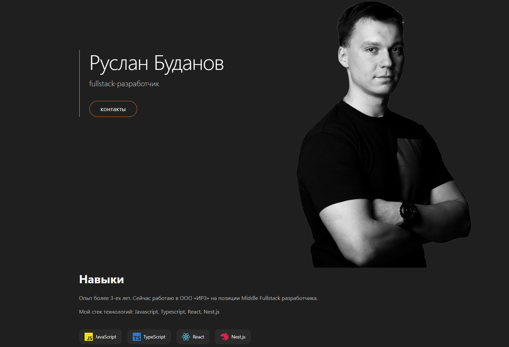

# Визитка

Страница обо мне. Содержит мои контакты, описание опыта и навыков

## Технологии

- Typescript, React, Material UI, Tanstack React Query
- Nest.js, PostgreSQL, GraphQl
- Jest, Vitest
- Docker
- Claude Code

### Функциональность

- Отображение информации обо мне, контакты и навыки
- Ссылки на готовые публичные проекты
- Счетчик посещений

#### Запустить проект можно

с помощью команды `docker compose up -d`

#### Проект выполнен

в рамках тестового задания на позицию fullstack разработчика с применением Claude Code
